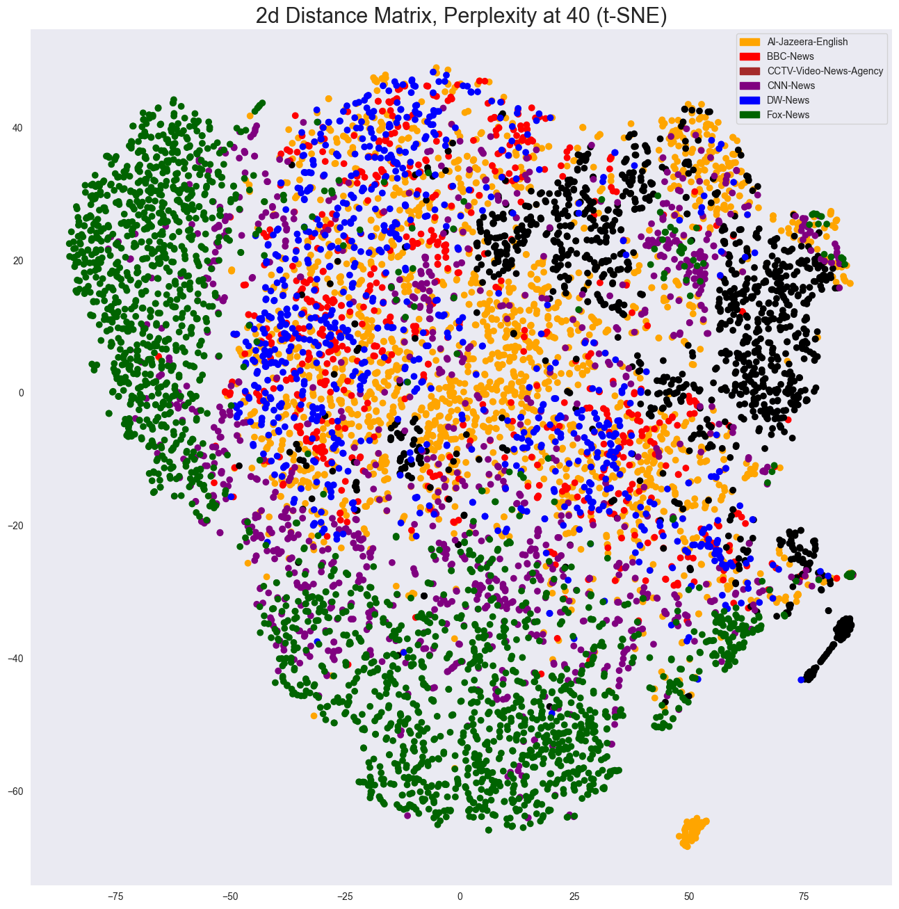
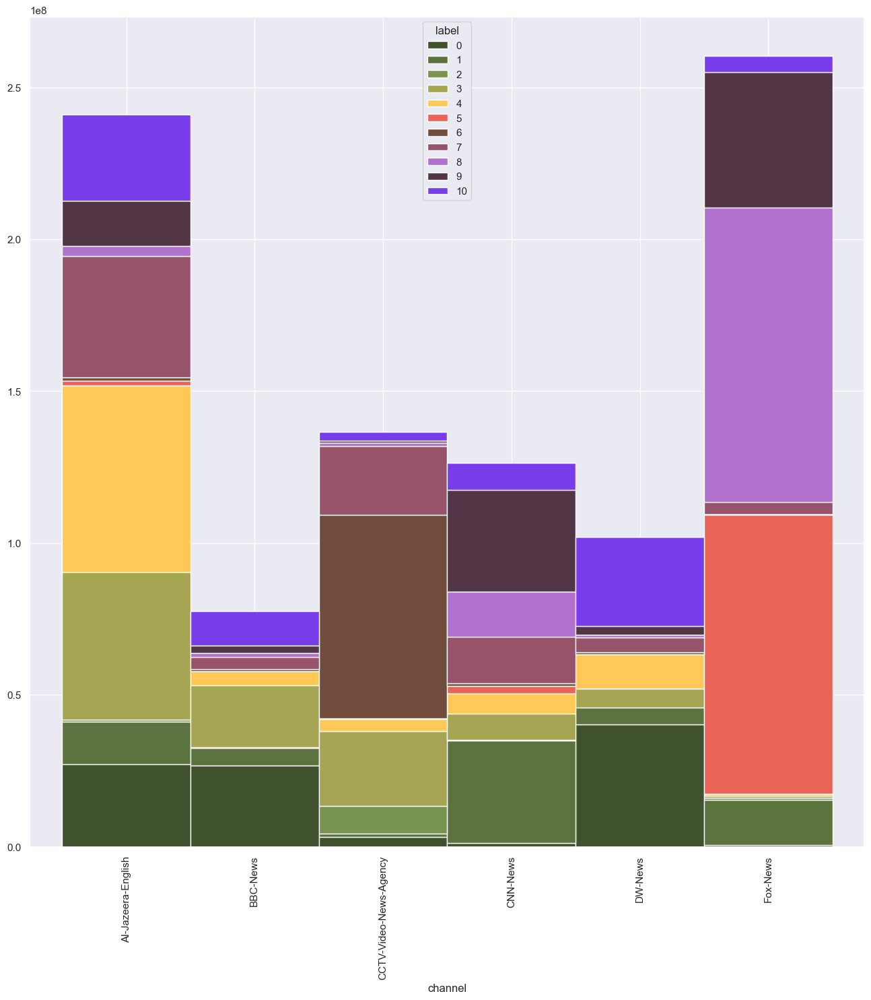
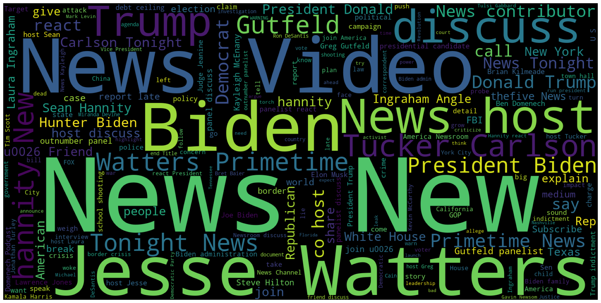
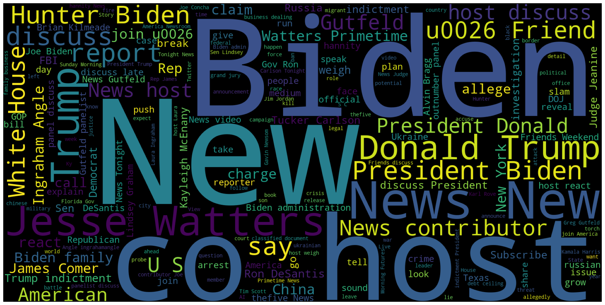

## Comparing the distance matrix colored by cluster and colored by channel

### Things to compare:
    - overlap of cluster and channel
        + compare amount of videos per cluster within each channel
        + compare amount of videos per cluster between channels
    - cluster similarity
        + compare word clouds on similarity
        + compare cluster entries in common_words.csv between each other
        

  
  

## Cluster distribution

| Cluster | Al-Jazeera-English | BBC-News | CCTV-Video-News-Agency | CNN-News | DW-News | Fox-News |
|---------|--------------------|----------|------------------------|----------|---------|----------|
| 0       | 221                | 227      | 26                     | 14       | 331     | 4        |
| 1       | 128                | 47       | 13                     | 286      | 48      | 139      |
| 2       | 5                  | 1        | 83                     | 1        | 0       | 8        |
| 3       | 379                | 160      | 208                    | 76       | 54      | 8        |
| 4       | 498                | 40       | 30                     | 50       | 84      | 7        |
| 5       | 10                 | 0        | 4                      | 23       | 2       | 757      |
| 6       | 8                  | 5        | 559                    | 7        | 4       | 1        |
| 7       | 303                | 29       | 212                    | 130      | 39      | 32       |
| 8       | 26                 | 13       | 8                      | 123      | 7       | 826      |
| 9       | 101                | 18       | 6                      | 302      | 21      | 419      |
| 10      | 244                | 97       | 25                     | 70       | 249     | 52       |

We can already tell, that certain cluster are tight to specific channels. For example cluster 5 is almost entirely 
inherited by Fox-News videos. 
This is even clearer to see in the following plot.

  

Here we can also see, that cluster 5 and 8 mainly appear on Fox-News as well as CNN-News. By comparing the two
word-clouds

  
  

it becomes apparent, that these two clusters are mainly about US domestic politics, while cluster 5 clearly is linked
to Fox-News.
If we have a closer look at the common words within these clusters it becomes apparent why.

>insert table
